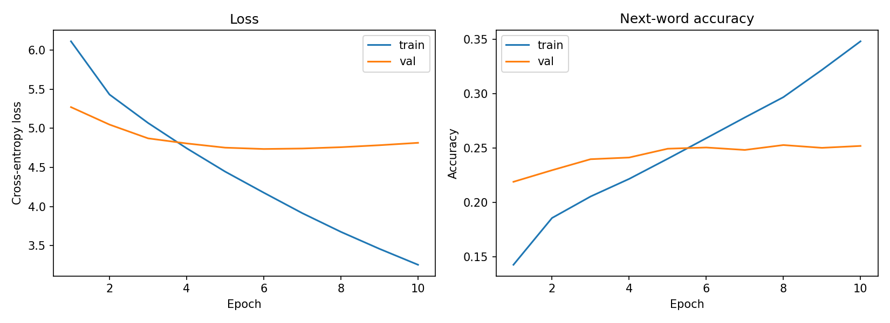

# Next Word Prediction (LSTM)

A next-word-prediction model (PyTorch LSTM) trained on ~6,500 Medium
article titles (`medium_data.csv`), plus a blog post explaining the
N-gram language model that motivates the neural approach.

📝 **Medium blog post (N-gram model):** https://medium.com/@chn25cse400/n-gram-model-a-simple-introduction-to-predicting-the-next-word-a34f6233b9be

## 🏁 Results at a glance

| Metric (validation set, best epoch) | Value |
|---|---:|
| Cross-entropy loss | 4.735 |
| Next-word accuracy (top-1) | 25.1% |
| Perplexity | 113.8 |

Accuracy of ~25% and perplexity of ~114 are reasonable for this setup:
titles are short and very diverse, the vocabulary is ~3,100 words and
there are only ~39k training examples, so many next words are genuinely
unpredictable. For reference, random guessing over 3,124 words would give
perplexity ≈ 3,124 and accuracy ≈ 0.03%.

Curves: `outputs/loss_curve.png` · Samples: `outputs/sample_predictions.txt`



## 📁 Files

```
├── medium_data.csv          # dataset (we use the `title` column)
├── preprocess.py            # cleaning, tokenizing, vocab, n-gram sequence generation
├── model.py                 # PyTorch LSTM model definition
├── train.py                 # training loop, curves, best-checkpoint saving
├── experiments.py           # hyperparameter comparison
├── generate.py              # evaluation + sample predictions & text generation
├── blog_post_ngram.md       # source text of the Medium blog post
├── requirements.txt
├── data/                    # created by preprocess.py
└── outputs/
    ├── model.pt
    ├── training_history.json
    ├── loss_curve.png
    ├── sample_predictions.txt
    ├── experiments.json
    └── experiments.md
```

## 1️⃣ Blog Post : N-Gram Model

See the Medium link at the top. The post covers what an N-gram is, how
N-gram models are trained (counting + smoothing), perplexity, use cases,
advantages, limitations and why neural models like this LSTM improve on
them. Source text is in `blog_post_ngram.md`.

## 2️⃣ Data Preparation

`preprocess.py` builds training data from the `title` column (6,508 titles):

1. **Clean & lowercase**: keep only letters, digits, apostrophes, spaces.
2. **Tokenize** on whitespace.
3. **Split at the title level** (80% train / 20% val) *before* creating
   examples, so fragments of one title never leak between splits.
4. **Build the vocabulary from training titles only** (words seen ≥ 2
   times; the rest become `<UNK>`), keeping validation a fair test.
5. **Create n-gram-style sequences**: every prefix of a title is one
   example labelled with the next word, pre-padded with `<PAD>` to 19 tokens.

| | |
|---|---:|
| Titles with ≥2 tokens | 6,495 |
| Train / val titles | 5,196 / 1,299 |
| Vocabulary size (min freq = 2) | 3,124 |
| Train examples | 38,846 |
| Val examples | 9,749 |
| Sequence length | 19 tokens |

## 3️⃣ Model Development

```
token ids -> Embedding(3124, 256) -> LSTM(256 -> 256) -> Dropout(0.5) -> Linear(256 -> 3124)
```

Sequences are pre-padded, so the LSTM's last timestep is always the real
last token of the prefix; the model reads `output[:, -1, :]`.

Training: batch size 128, Adam (lr 1e-3), cross-entropy loss, 10 epochs,
best checkpoint (lowest val loss) saved. Train/val loss, accuracy and
perplexity are logged every epoch.

### Hyperparameter experiments (`experiments.py`)

Each config trained for 12 epochs; best validation epoch reported.

| Config | Embed | Hidden | Layers | Dropout | Best epoch | Val loss | Val acc | Val perplexity |
|---|---|---|---|---|---|---|---|---|
| baseline | 100 | 150 | 1 | 0.2 | 8 | 4.798 | 0.248 | 121.3 |
| dropout 0.5 | 100 | 150 | 1 | 0.5 | 12 | 4.785 | 0.248 | 119.7 |
| **bigger (256/256)** | 256 | 256 | 1 | 0.5 | 7 | **4.736** | 0.247 | **113.9** |
| 2 layers | 100 | 150 | 2 | 0.5 | 12 | 4.877 | 0.243 | 131.3 |
| small (50/100) | 50 | 100 | 1 | 0.3 | 12 | 4.848 | 0.242 | 127.5 |

Takeaways: more dropout helped slightly, a wider model helped most and a
second LSTM layer *hurt*, with only ~39k examples, extra depth mostly adds
overfitting. The 256/256 config is the default in `train.py`.

**Overfitting:** validation loss bottoms out at epoch 6 (4.73) and then
rises while training loss keeps falling (train perplexity 26 vs val 123 at
epoch 10). That is why the best-val-loss checkpoint is kept rather than the
final epoch.

## 4️⃣ Evaluation & Sample Predictions

`generate.py` reloads the best checkpoint, recomputes validation loss /
accuracy / perplexity, and shows top-5 predictions plus greedy 8-word
continuations (`<PAD>`/`<UNK>` are masked out so they're never suggested).

Top-5 next-word predictions (from `outputs/sample_predictions.txt`):

| Seed | Top predictions (probability) |
|---|---|
| "how to build a" | ux (0.03), better (0.03), new (0.02), writer (0.02), job (0.02) |
| "a beginner's guide to" | the (0.04), a (0.03), your (0.01), be (0.01), an (0.01) |
| "introduction to" | the (0.05), be (0.03), a (0.02), your (0.02), machine (0.02) |
| "the future of" | the (0.12), your (0.06), a (0.04), ai (0.03), data (0.02) |
| "why you should learn" | from (0.52), in (0.03), a (0.03), the (0.02), on (0.02) |

Greedy continuations, e.g. `"why you should learn" -> "why you should learn
from the best way to be a better"` and `"how to build a" -> "how to build a ux
case study in 2019 design system in"`.

**Limitations (honest notes):** greedy decoding tends to loop
(`"the future of the future of the future..."`), and probabilities are
spread thinly because many continuations are plausible. Sampling
(top-k / temperature), more data (article text instead of titles), or a
Transformer would be natural next steps.

## ⚙️ Setup & run

```bash
pip install -r requirements.txt
python preprocess.py
python train.py
python experiments.py   # optional, ~15 min on CPU
python generate.py
```

## Notes on scope

The dataset is Medium article *titles*, which are short and clean and keep
training fast while still containing recurring phrase structure ("a
beginner's guide to …", "introduction to …"). `preprocess.py` works on any
text column if you want to train on longer text.
